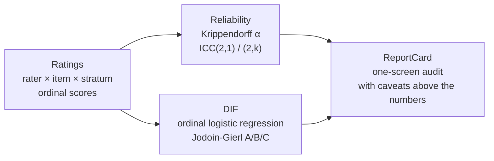

# metajudge

A reliability and DIF report card for LLM-judge and human-rater scoring instruments.

[](https://github.com/brittanyreese/metajudge/actions/workflows/ci.yml)
[](https://pypi.org/project/metajudge/)


[](https://github.com/astral-sh/ruff)
[](https://doi.org/10.5281/zenodo.21162713)

An LLM judge or scoring rubric is a measurement instrument. Before you report its scores, you want to know whether the raters agree, whether they score some output types differently, and how large any gap is. `metajudge` prints a one-screen report card that answers those questions for any multi-rater ordinal panel, LLM judges or human annotators. It audits the scoring instrument, not the model under test.

It works on subjective ordinal scores (coherence, helpfulness, quality) where no gold label exists, so it complements gold-label evaluation (accuracy benchmarks, IRT-over-judges) rather than competing with it. Every statistic is checked against an external reference implementation (see [Numerical correctness](#numerical-correctness)).



One long-format data model feeds two pillars, and both render into a single report card.

## Try it on the demo

The library ships a real corpus (SummEval expert coherence), so the example below runs end to end after [install](#install):

```bash
pip install metajudge
python -c "from metajudge import load_demo, audit; print(audit(load_demo(), focal='abstractive', reference='extractive').to_markdown())"
```

A runnable script is at [`examples/audit_summeval.py`](https://github.com/brittanyreese/metajudge/blob/main/examples/audit_summeval.py), with expected output in `examples/sample_output.txt`:

```python
from metajudge import load_demo, audit

ratings = load_demo()   # SummEval expert coherence: 1600 items, 3 expert raters,
                        # stratum = system family (extractive vs abstractive)
report = audit(ratings, focal="abstractive", reference="extractive")
print(report.to_markdown())
```

It prints the report card below, with the live numbers exactly as the command produces them:

```
# metajudge report card

## Reliability
> Note: high agreement (alpha, ICC) is not evidence the rubric measures the intended construct. It shows raters apply the scale consistently, not that the scale captures the quality you care about.

- Krippendorff's alpha (ordinal): 0.554 [95% CI 0.529, 0.578]
- ICC(2,1): 0.573 [95% CI 0.449, 0.664]; ICC(2,k): 0.801 [95% CI 0.710, 0.856] (1600 targets x 3 raters)

## DIF (panel-relative, rest-score conditioner)
> Note: two limits bound this read. Strata nest items (each item is in one stratum), so the conditioner matches quality between nested item sets, not within shared items; if the strata differ in quality it correlates with the group and residual confounding (DIF impurity) remains. And the rest-score conditioner cannot see bias shared across the entire rater panel. Pass a valid independent external quality conditioner for a stronger, instrument-level analysis; absent that, read the effect size as panel-relative screening evidence, not an instrument-level fairness clearance.

- abstractive vs extractive (conditioner: rest_score, n=4800)
- Effect size (Nagelkerke R2 delta): 0.002 (Jodoin-Gierl class A)
- Clustering-robust significance: not assessed. The analytic p-values below are anti-conservative under the crossed rater x item design; run audit(robust=True) or cluster_bootstrap_dif() for a clustering-robust flag.
- Uniform DIF: chi2(1)=12.15, p=0.0005 [analytic, unclustered]
- Nonuniform DIF: chi2(1)=0.17, p=0.6773 [analytic, unclustered]
```

## How to read the report card

### Reliability

Reliability rests on two measures, Krippendorff's alpha and ICC. Both rise when raters converge: alpha is a chance-corrected agreement coefficient, ICC a variance-ratio reliability coefficient (the share of score variance that is rater-consistent signal). ICC(2,k) is higher than ICC(2,1) because averaging three raters cancels some of the per-rater noise.

Krippendorff's bands put the demo's 0.554 below even the tentative floor, so these coherence scores are only marginally reliable, which is the kind of result this tool exists to surface:

| Krippendorff α | Reading |
|---|---|
| ≥ 0.80 | Reliable |
| 0.667 to 0.80 | Tentative conclusions only |
| < 0.667 | Marginal (the demo's 0.554 lands here) |

The reliability estimators assume a complete crossed design. On a matrix with missing cells `icc` refuses and names the estimator that does handle incomplete data, rather than returning a number it cannot defend. The reasoning is recorded as a dated ADR.

### DIF

DIF, differential item functioning, asks whether the panel scores abstractive outputs differently from extractive outputs once you condition on the rest-score proxy for overall quality. The "item" under audit is the rubric criterion rather than a shared test item, since each stratum scores different outputs. The engine is ordinal logistic regression in the Zumbo tradition (single-pass, not lordif's iterative purification), run as three nested proportional-odds models, so it reports a uniform-DIF test, a nonuniform-DIF test, and an effect size (the Nagelkerke pseudo-R-squared change) classified A, B, or C by the Jodoin-Gierl thresholds. The demo shows why the card prints both a p-value and an effect size: at n = 4800 the uniform-DIF test is significant (p = 0.0005), but the effect size is 0.002, class A, which is negligible. The signal is detectable; the magnitude is not.

The matching variable is a leave-one-rater-out rest score across the three expert raters, which uses the same exchangeable-rater assumption as the reliability pillar. That rest score detects bias relative to the rater panel and understates bias the whole panel shares, so the card labels this path panel-relative DIF. For a stronger DIF analysis, pass an explicit external quality conditioner: `audit(ratings, focal=..., reference=..., conditioner=...)` accepts a sample-id to quality-score mapping. External-conditioner DIF supports instrument-level interpretation only when the conditioner is valid, independent, and appropriate for the quality construct being matched. Read DIF output as a screening audit, not a confirmatory significance claim. When a p-value lands near a decision threshold, `cluster_bootstrap_dif` runs the same engine with item-block resampling and returns a 95% cluster-robust interval alongside the unchanged point estimate.

## Audit your own judge

To audit a real instrument, point metajudge at the output of an existing judge runner. `Ratings.from_eval_instruments` maps the per-judge score frames produced by Epic's [`evaluation-instruments`](https://github.com/epic-open-source/evaluation-instruments) (`frame_from_evals`) into the `Ratings` the audit consumes: rater is judge, item is sample, score is one rubric criterion. It is a local DataFrame transform that adds no dependency. A runnable, no-PHI walkthrough is in [docs/interop-epic.md](https://github.com/brittanyreese/metajudge/blob/main/docs/interop-epic.md).

For a self-contained, end-to-end example that builds the judge panel itself, [`examples/audit_llm_judge.py`](https://github.com/brittanyreese/metajudge/blob/main/examples/audit_llm_judge.py) runs three LLM judges over 16 stratified summaries and prints the report card. Install with `pip install "metajudge[examples]"`. Then pick a mode: `--mode live --provider gemini` calls Gemini models on a billed project (`GOOGLE_AI_API_KEY`); `--mode live --provider openrouter` calls free-tier OpenRouter models (`OPENROUTER_API_KEY`, capacity not guaranteed); `--mode offline` runs a seeded simulation with no key or network.

This is what a real LLM panel looks like through the same card (a live Gemini run, committed as [`examples/sample_output_llm.txt`](https://github.com/brittanyreese/metajudge/blob/main/examples/sample_output_llm.txt); at 16 items it is a format demonstration, not a study):

```
_LIVE LLM JUDGE PANEL (gemini) -- gemini-2.5-flash, gemini-2.5-flash-lite, gemini-3.5-flash_
Judges: 3 | Items: 16 (extractive vs abstractive) | Score: coherence 1-5

## Reliability
- Krippendorff's alpha (ordinal): 0.993 [95% CI 0.960, 1.000]
- ICC(2,1): 0.991; ICC(2,k): 0.997 (16 targets x 3 raters)

## DIF (panel-relative, rest-score conditioner)
- abstractive vs extractive (conditioner: rest_score, n=48)
- Effect size (Nagelkerke R2 delta): 0.000 (Jodoin-Gierl class A)
- Cluster-robust R2 delta CI: [0.000, 0.006] (n_effective=178 of 200)
```

| Panel | Krippendorff α | ICC(2,1) | ICC(2,k) |
|---|---|---|---|
| Human experts (SummEval, n=1600) | 0.554 | 0.573 | 0.801 |
| Gemini judges (n=16) | 0.993 | 0.991 | 0.997 |

Three Gemini judges agree with each other almost perfectly, while the human experts reach only 0.554. Near-perfect agreement is exactly when the reliability caveat matters most: a panel can agree completely and still be wrong about the construct.

## Cluster-robust DIF confidence intervals

The analytic likelihood-ratio test pools every (item, rater) cell as independent. In a crossed rater-by-item design that is anti-conservative: scores for the same item are correlated across raters. `cluster_bootstrap_dif` keeps the analytic point estimate and adds percentile confidence intervals (default 95%) for the effect size and the total-DIF chi-square by resampling whole item blocks. These are robustness intervals, not corrected p-values.

```python
from metajudge import load_demo, cluster_bootstrap_dif

ratings = load_demo()
# Each resample refits the engine, so runtime grows with n_boot and corpus size.
# The 1600-item demo takes about a minute at n_boot=200; the default is n_boot=1000.
cb = cluster_bootstrap_dif(
    ratings, focal="abstractive", reference="extractive", n_boot=200, seed=0
)
print(f"R² delta: {cb.base.nagelkerke_r2_delta:.3f}")
print(f"95% cluster CI: [{cb.r2_delta_ci_low:.3f}, {cb.r2_delta_ci_high:.3f}]")
print(f"CI reliable: {cb.ci_reliable}  (n_effective={cb.n_effective})")
```

Degenerate resamples (draws with no ordinal variation) are dropped; check `cb.ci_reliable` before reading the bounds. When fewer than 100 resamples survive, the bounds are indicative only and `cb.base` (the analytic estimate) is the honest number to report.

One dependence axis remains unhandled: resampling item blocks preserves the cross-rater correlation within an item, but the same judge panel scores every item, and that cross-item within-rater dependence is not resampled. The intervals stay mildly optimistic on that axis; the principled fix is a mixed or GEE model, recorded as out of scope in the cluster-bootstrap ADR.

## Scope and limits

- It covers two pillars: reliability (Krippendorff's alpha with a bootstrap CI, and ICC(2,1)/(2,k)) and DIF for one focal-versus-reference contrast at a time. It is not a full validity or variance-decomposition framework.
- The analytic likelihood-ratio test is anti-conservative in the crossed rater-by-item design; `cluster_bootstrap_dif` (above) adds item-block-resampled confidence intervals alongside the analytic point estimate. The tool is a screen: it flags instruments worth a closer look and leaves the verdict to a fuller analysis.
- The demo numbers illustrate the report-card format on a real corpus. They are not a published claim about SummEval.

## Install

```bash
pip install metajudge
```

Or install the latest unreleased main from source:

```bash
pip install git+https://github.com/brittanyreese/metajudge@main
```

Requires Python 3.11 or later.

## Develop

```bash
uv sync               # install runtime + dev deps
uv run pytest         # tests (coverage runs automatically)
uv run ruff check .   # lint
uv run ruff format .  # format
uv run pyright        # strict type-check
```

## Numerical correctness

Every statistic is tested against an external reference implementation, not just internal consistency. Each test asserts against a value a trusted tool produced:

- Krippendorff's alpha is checked against the `krippendorff` package.
- ICC(2,1)/(2,k) is checked against the Shrout-Fleiss (1979) worked example and the `pingouin` ICC values, reproduced to six decimals.
- DIF is checked against R `MASS::polr`, the canonical proportional-odds fit, with an in-process cross-check against `statsmodels` logistic regression in the two-category limit. `statsmodels` and `pingouin` are test oracles only; they are never imported at runtime.

When a reference value and a literal disagree, the reference wins and the literal is corrected. Tolerances are not loosened to make a test pass.

Two test suites enforce this at different depths. Every push and pull request runs the fast suite (oracle pins, engine tests, quick simulation guards). A weekly [Rigor workflow](https://github.com/brittanyreese/metajudge/blob/main/.github/workflows/rigor.yml), also required before any release, runs the full-precision operating-characteristics tests (Type-I control, power, bootstrap coverage at 400 replications per cell) and refits the R `MASS::polr` oracle live.

The measured operating characteristics themselves (Type-I error, power curves, proportional-odds robustness, and the calibration behind the conditioner-overlap warning) are reported in [docs/sim-operating-characteristics.md](https://github.com/brittanyreese/metajudge/blob/main/docs/sim-operating-characteristics.md), with seeds and raw draws committed so every number regenerates.

## Citing

If you use metajudge in published work, cite it via the [`CITATION.cff`](https://github.com/brittanyreese/metajudge/blob/main/CITATION.cff) file (GitHub's "Cite this repository" generates APA and BibTeX from it). The methods the tool implements are credited to their original authors in [docs/REFERENCES.md](https://github.com/brittanyreese/metajudge/blob/main/docs/REFERENCES.md).

## License

MIT. See [LICENSE](https://github.com/brittanyreese/metajudge/blob/main/LICENSE). The bundled SummEval demo corpus is redistributed under its own MIT license; see [its source notice](https://github.com/brittanyreese/metajudge/blob/main/src/metajudge/data/SOURCE.md).

## Decisions and provenance

Every choice that changes the build is a dated, cited ADR. The curated index of what was decided and why is [docs/DECISIONS.md](https://github.com/brittanyreese/metajudge/blob/main/docs/DECISIONS.md): the ordinal-DIF engine, the ICC refusal on incomplete data, and the SummEval corpus lock. The why-this-build context is in [docs/PROVENANCE.md](https://github.com/brittanyreese/metajudge/blob/main/docs/PROVENANCE.md), and the full records live in [docs/decisions/](https://github.com/brittanyreese/metajudge/tree/main/docs/decisions/).

Built with AI coding tools under the review, testing, and external-oracle validation gates in [CONTRIBUTING](https://github.com/brittanyreese/metajudge/blob/main/CONTRIBUTING.md#ai-assistance). The maintainer makes the design decisions and validates every result against those references.
